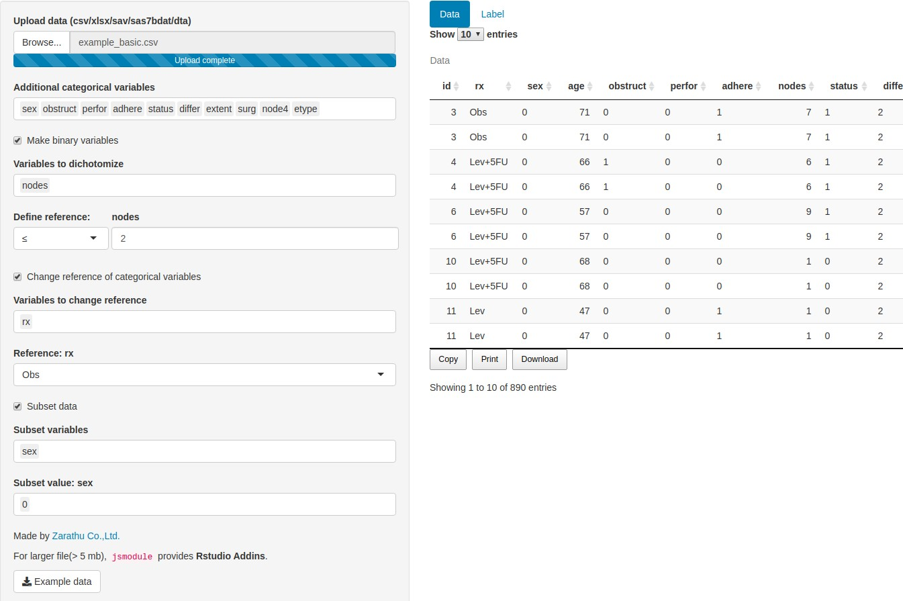
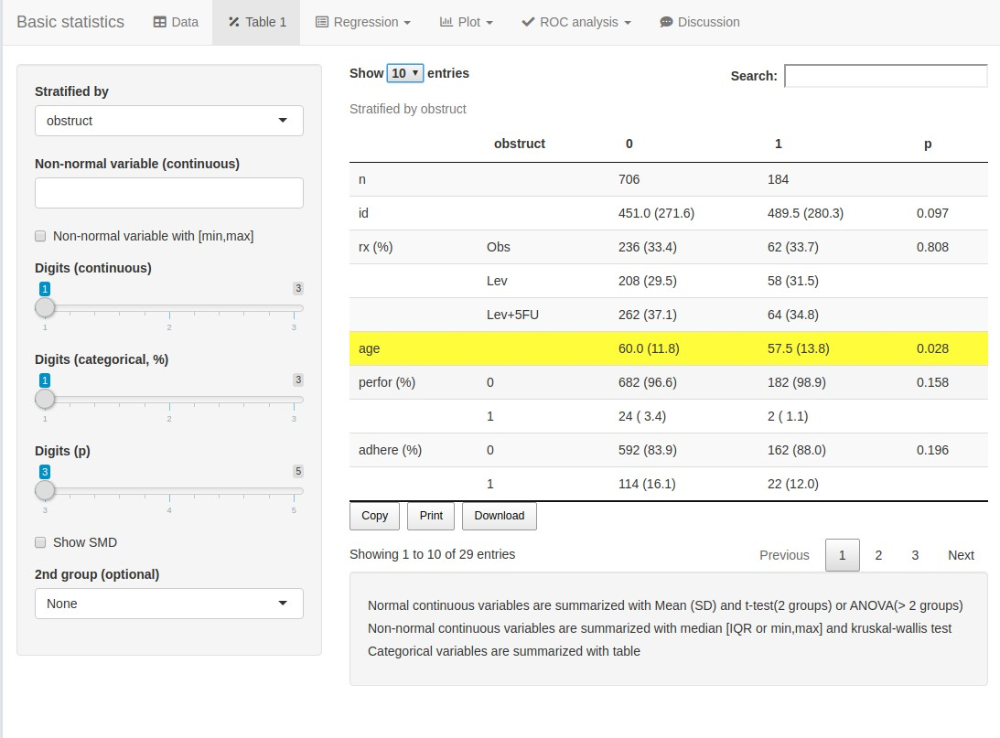
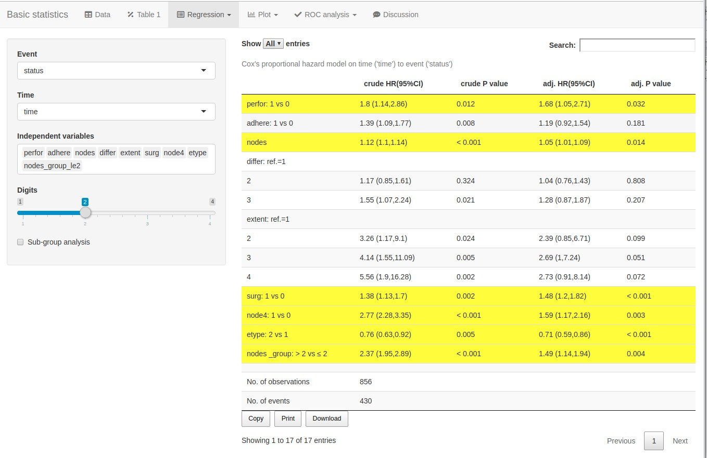
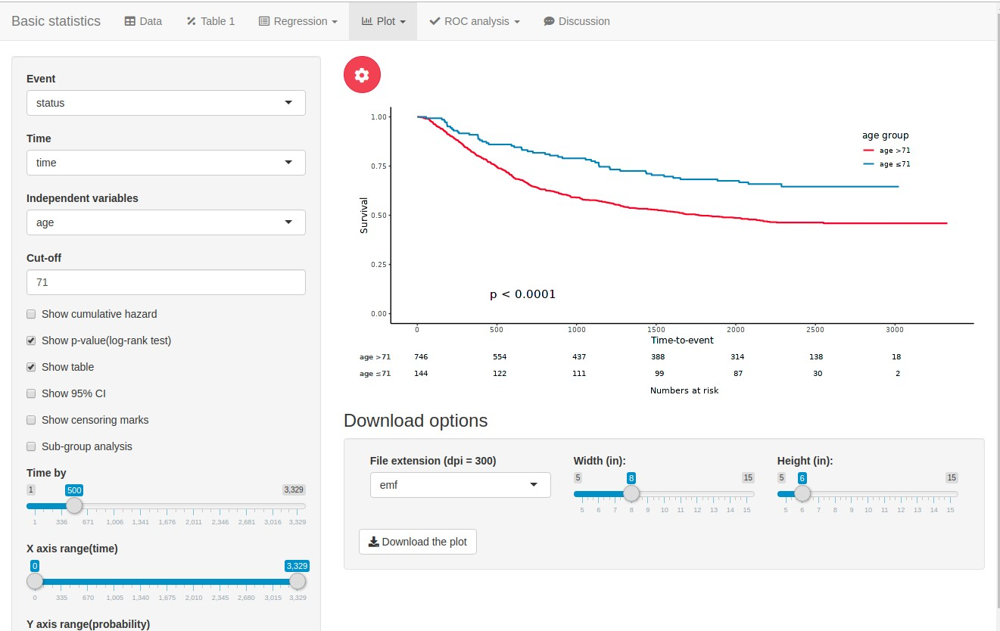
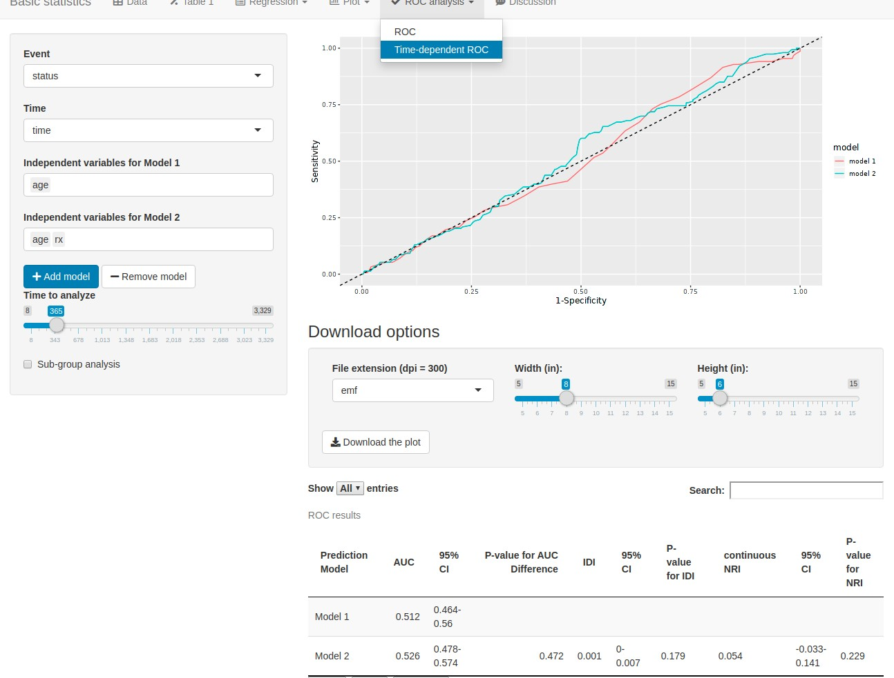
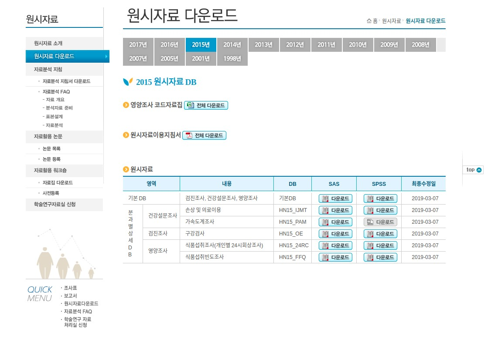
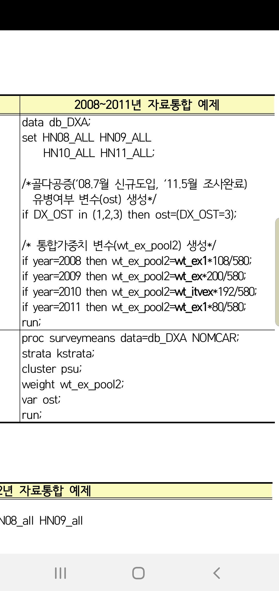
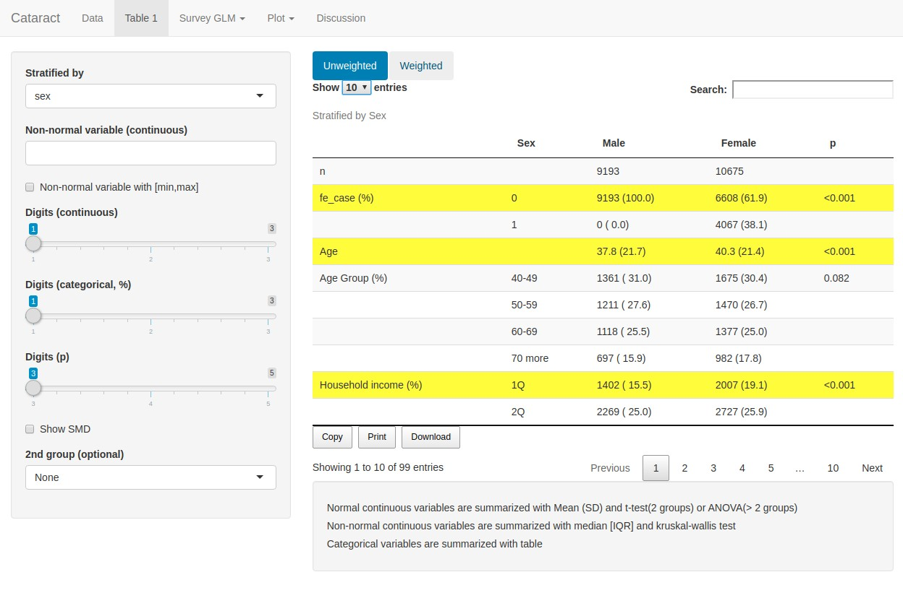
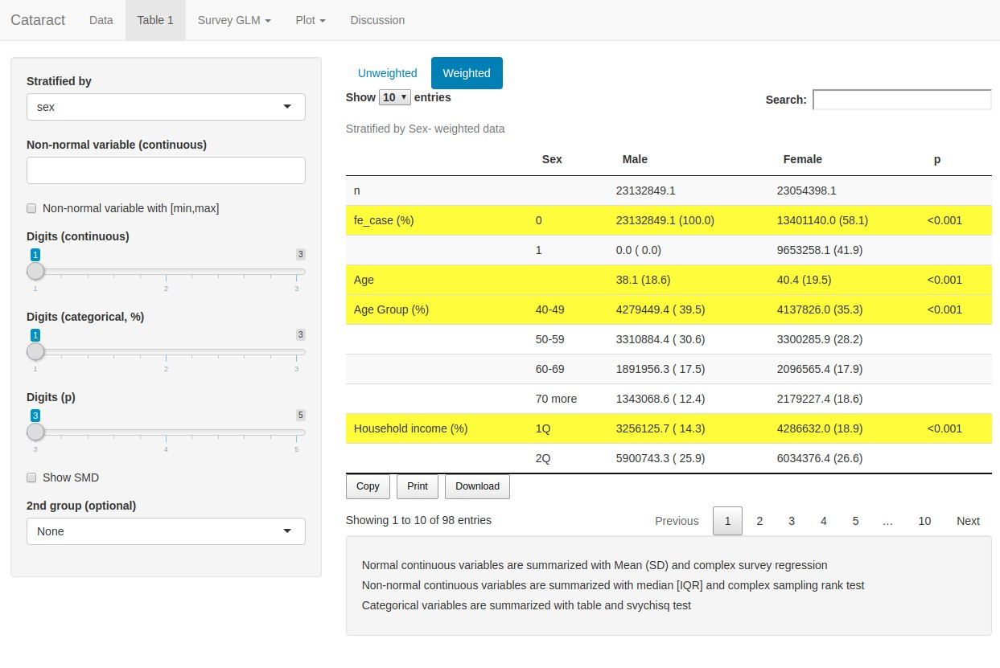
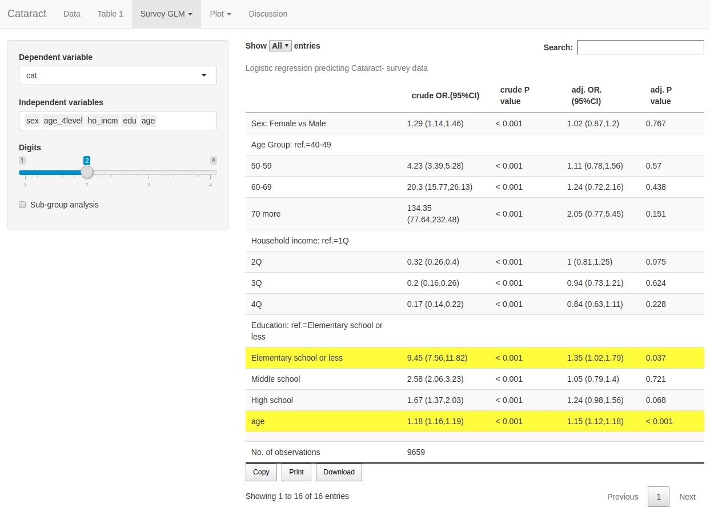

```{r setup, include=FALSE}
options(htmltools.dir.version = FALSE)
knitr::opts_chunk$set(echo = T, fig.align = "center", message = F, warning = F)
library(knitr);library(DT);library(dplyr);library(data.table);library(rmarkdown);library(readr);library(purrr);library(tidyr)
```


layout: true

<div class="my-footer"><span><a href="https://www.zarathu.com">Zarathu Co.,Ltd</a>   
&emsp;&emsp;&emsp;&emsp;&emsp;&emsp;&emsp;&emsp;&emsp;&emsp;&emsp;&emsp;&emsp;
&emsp;&emsp;&emsp;&emsp;&emsp;&emsp;&emsp;&emsp;&emsp;&emsp;&emsp;&emsp;&emsp;
<a href="https://github.com/jinseob2kim">김진섭</a></span></div> 


---

# Executive Summary 

.large[
[R](https://www.r-project.org/)로 **심평원, 공단** 빅데이터의 데이터 정리와 통계분석을 수행하였다.
]

--

.large[
* [haven](https://github.com/tidyverse/haven) 패키지로 SAS 파일을 직접 읽을 수 있다.

* [dplyr](https://dplyr.tidyverse.org), [data.table](https://github.com/Rdatatable/data.table) 을 활용, 기존 [R](https://www.r-project.org/) 문법보다 빠르게 데이터 를 정리할 수 있다.  


* [dbplyr](https://dplyr.tidyverse.org) 를 활용, [R](https://www.r-project.org/) 코드를 **PROC SQL** 문으로 바꿔 복잡한 SAS 작업을 수행할 수 있다. 
]

--
.large[
* 자체 개발한 [jsmodule](https://github.com/jinseob2kim/jsmodule) 패키지를 이용, GUI 환경에서 기술통계와 회귀/생존분석을 수행하고 테이블과 그림을 바로 다운받는다.
]

--
.large[ 
[jsmodule](https://github.com/jinseob2kim/jsmodule) 의 [표본조사 데이터 분석](http://app.zarathu.com/survey/) 기능을 활용, GUI 환경에서 **국건영** 데이터 분석을 수행하였다.
]

---
# Why [R](https://www.r-project.org/)?

.large[
**장점** 

- 더 간단한 코드: 특히 **Group by** 작업 

- 테이블, 그림, 반출용 리포트를 바로 만들 수 있다.


**단점**

- Memory 문제: 용량 큰 데이터는 SAS 전처리 필요.

- 공단 명동분석실 환경악화: 램 8gb, 하드 100gb
]


---

class: center, middle

# 데이터 매니지먼트


---
# Read SAS file

[haven](https://haven.tidyverse.org/) 패키지의 `read_sas` 이용


```r
library(haven)
*t20 <- read_sas("t20_example.sas7bdat")  
t20[1:100, ]                            ## Show first 100 rows
```

```{r, eval = T, echo = F}
library(haven)
#t29 <- read_sas("docs/t20_example.sas7bdat")
t20 <- read_sas("t20_example.sas7bdat")
t20[1:100, ] %>% paged_table()              ## Show first 100 rows
```


---
# Read multiple SAS file

공단데이터는 **월별**로 쪼개서 줌. `lapply` 와 `dplyr::bind_row` 로 합친 데이터 만듦

```r
library(dplyr)
## 월별 명세서 데이터
data.t20 <- list.files(pattern = "t20") %>%  ## filename contains "t20"
*  lapply(read_sas) %>% 
*  bind_rows 

## 월별 x-ray 데이터
data.xray <- list.files(pattern = "t30") %>% 
  lapply(function(x){
    read_sas(x) %>% 
    filter(substr(MCARE_DIV_CD_ADJ, 1, 3) == "G21") %>% 
    select(CMN_KEY, MCARE_DIV_CD_ADJ)
    }) %>% 
  bind_rows 
```

```{r, eval = F, echo = F}
library(dplyr)

## 월별 명세서 데이터
data.t20 <- list.files(pattern = "t20") %>%  ## filename contains "t20"
  lapply(read_sas) %>% 
  bind_rows 

## 월별 x-ray 데이터
data.xray <- list.files(pattern = "t30") %>% 
  lapply(function(x){
    read_sas(x) %>% 
    filter(substr(MCARE_DIV_CD_ADJ, 1, 3) == "G21") %>% 
    select(CMN_KEY, MCARE_DIV_CD_ADJ)
    }) %>% 
  bind_rows 
```

---
# Grammar choice

.pull-left[
<center>
<a href="https://dplyr.tidyverse.org/"></a>
</center>

- 직관성: `%>%` 연산자, `group_by` 함수  

- `read_sas` 후 바로 적용 가능.

https://blog.zarathu.com/posts/2019-01-03-rdatamanagement/

]

.pull-right[
<center>
<a href="https://rdatatable.gitlab.io/data.table/"></a>
</center>

- 빠르고 간결한 코드

- Group 변수를 `setkey` 로 미리 설정하면 더 빠름.

- `read_sas` 후 `data.table` 클래스로 바꿔야 함.

https://jinseob2kim.github.io/radv1.html
]


---

# Comparison: 최초 자살시도 


[dplyr](https://dplyr.tidyverse.org/)

```{r, eval = F}
out <- t20 %>% 
  filter(substr(SICK_SYM1, 1, 3) %in% paste0("X", 60:84)) %>%  ## X60-84: suicide
  arrange(MDCARE_STRT_DT) %>%
  mutate(YEAR = substr(MDCARE_STRT_DT, 1, 4)) %>%              ## add year variable
  group_by(INDI_DSCM_NO) %>%                                   ## group by individual
  filter(row_number() == 1)                                    ## 1st row
```

[data.table](https://rdatatable.gitlab.io/data.table/)

```{r, eval = F}
library(data.table)
t20 <- data.table(t20)
setkey(t20, INDI_DSCM_NO)  ## Fast groupby operation

out <- t20[substr(SICK_SYM1, 1, 3) %in% paste0("X", 60:84)][order(MDCARE_STRT_DT)][, YEAR := substr(MDCARE_STRT_DT, 1, 4)][, .SD[1], by = INDI_DSCM_NO] 
```

---
# [dplyr](https://dplyr.tidyverse.org/) to SQL

[dbplyr](https://dbplyr.tidyverse.org) 패키지로 [dplyr](https://dplyr.tidyverse.org/) 문법을 **SQL** 문으로 바꿀 수 있다.

```r
library(dbplyr)
*t20.db <- tbl_memdb(t20)                               ## DB type data
t20.db %>% 
  filter(substr(SICK_SYM1, 1, 3) %in% paste0("X", 60:84)) %>% 
  arrange(MDCARE_STRT_DT) %>%
  mutate(YEAR = substr(MDCARE_STRT_DT, 1, 4)) %>%       ## Add year variable
  group_by(INDI_DSCM_NO) %>%                            ## group by individual
  filter(row_number() == 1) %>%                         ## 1st row
* show_query                                            ## Show SQL query
```

```sql
SELECT `INDI_DSCM_NO`, `RN_KEY`, `RN_INST`, `MDCARE_STRT_DT`, `FORM_CD`, `MCARE_SUBJ_CD`, `SICK_SYM1`, `SICK_SYM2`, `HSPTZ_PATH_TYPE`, `OFIJ_TYPE`, `OPRTN_YN`, `MDCARE_DD_CNT`, `VSHSP_DD_CNT`, `TOT_PRSC_DD_CNT`, `MCARE_RSLT_TYPE`, `FST_HSPTZ_DT`, `EDC_ADD_RT`, `SPCF_SYM_TYPE`, `ED_RC_TOT_AMT`, `EDC_SBA`, `EDC_INSUR_BRDN_AMT`, `STD_YYYY`, `YEAR`
FROM (SELECT `INDI_DSCM_NO`, `RN_KEY`, `RN_INST`, `MDCARE_STRT_DT`, `FORM_CD`, `MCARE_SUBJ_CD`, `SICK_SYM1`, `SICK_SYM2`, `HSPTZ_PATH_TYPE`, `OFIJ_TYPE`, `OPRTN_YN`, `MDCARE_DD_CNT`, `VSHSP_DD_CNT`, `TOT_PRSC_DD_CNT`, `MCARE_RSLT_TYPE`, `FST_HSPTZ_DT`, `EDC_ADD_RT`, `SPCF_SYM_TYPE`, `ED_RC_TOT_AMT`, `EDC_SBA`, `EDC_INSUR_BRDN_AMT`, `STD_YYYY`, `YEAR`, ROW_NUMBER() OVER (PARTITION BY `INDI_DSCM_NO` ORDER BY `MDCARE_STRT_DT`) AS `zzz3`
      FROM (SELECT `INDI_DSCM_NO`, `RN_KEY`, `RN_INST`, `MDCARE_STRT_DT`, `FORM_CD`, `MCARE_SUBJ_CD`, `SICK_SYM1`, `SICK_SYM2`, `HSPTZ_PATH_TYPE`, `OFIJ_TYPE`, `OPRTN_YN`, `MDCARE_DD_CNT`, `VSHSP_DD_CNT`, `TOT_PRSC_DD_CNT`, `MCARE_RSLT_TYPE`, `FST_HSPTZ_DT`, `EDC_ADD_RT`, `SPCF_SYM_TYPE`, `ED_RC_TOT_AMT`, `EDC_SBA`, `EDC_INSUR_BRDN_AMT`, `STD_YYYY`, SUBSTR(`MDCARE_STRT_DT`, 1, 4) AS `YEAR`
            FROM (SELECT *
                    FROM (SELECT *
                            FROM `t20`
                          WHERE (SUBSTR(`SICK_SYM1`, 1, 3) IN 'X' || (60, 61, 62, 63, 64, 65, 66, 67, 68, 69, 70, 71, 72, 73, 74, 75, 76, 77, 78, 79, 80, 81, 82, 83, 84)))
                  ORDER BY `MDCARE_STRT_DT`)))
WHERE (`zzz3` = 1.0)
```

---
# SQL to SAS

생성된 **SQL** 은 바로 SAS **PROC SQL** 문으로 이용 가능.(따옴표는 삭제)

```sql
PROC SQL;
CREATE TABLE out AS
*SELECT INDI_DSCM_NO, RN_KEY, RN_INST, MDCARE_STRT_DT, FORM_CD, MCARE_SUBJ_CD, SICK_SYM1, SICK_SYM2, HSPTZ_PATH_TYPE, OFIJ_TYPE, OPRTN_YN, MDCARE_DD_CNT, VSHSP_DD_CNT, TOT_PRSC_DD_CNT, MCARE_RSLT_TYPE, FST_HSPTZ_DT, EDC_ADD_RT, SPCF_SYM_TYPE, ED_RC_TOT_AMT, EDC_SBA, EDC_INSUR_BRDN_AMT, STD_YYYY, YEAR
*FROM (SELECT INDI_DSCM_NO, RN_KEY, RN_INST, MDCARE_STRT_DT, FORM_CD, MCARE_SUBJ_CD, SICK_SYM1, SICK_SYM2, HSPTZ_PATH_TYPE, OFIJ_TYPE, OPRTN_YN, MDCARE_DD_CNT, VSHSP_DD_CNT, TOT_PRSC_DD_CNT, MCARE_RSLT_TYPE, FST_HSPTZ_DT, EDC_ADD_RT, SPCF_SYM_TYPE, ED_RC_TOT_AMT, EDC_SBA, EDC_INSUR_BRDN_AMT, STD_YYYY, YEAR, ROW_NUMBER() OVER (PARTITION BY INDI_DSCM_NO ORDER BY MDCARE_STRT_DT) AS zzz3
*       FROM (SELECT INDI_DSCM_NO, RN_KEY, RN_INST, MDCARE_STRT_DT, FORM_CD, MCARE_SUBJ_CD, SICK_SYM1, SICK_SYM2, HSPTZ_PATH_TYPE, OFIJ_TYPE, OPRTN_YN, MDCARE_DD_CNT, VSHSP_DD_CNT, TOT_PRSC_DD_CNT, MCARE_RSLT_TYPE, FST_HSPTZ_DT, EDC_ADD_RT, SPCF_SYM_TYPE, ED_RC_TOT_AMT, EDC_SBA, EDC_INSUR_BRDN_AMT, STD_YYYY, SUBSTR(MDCARE_STRT_DT, 1, 4) AS YEAR
*              FROM (SELECT *
*                       FROM (SELECT *
*                                FROM t20
*                              WHERE (SUBSTR(SICK_SYM1, 1, 3) IN 'X' || (60, 61, 62, 63, 64, 65, 66, 67, 68, 69, 70, 71, 72, 73, 74, 75, 76, 77, 78, 79, 80, 81, 82, 83, 84)))
*                     ORDER BY MDCARE_STRT_DT)))
*WHERE (zzz3 = 1.0)
QUIT;
```

--
[R](https://www.r-project.org/) 로 직관적인 코드를 만든 후, **PROC SQL** 문으로 바꿔 복잡한 SAS 작업을 수행할 수 있다. 
- 번역 불가능한 [R](https://www.r-project.org/) 함수도 있으므로 주의. 
- 도움말 https://dbplyr.tidyverse.org/articles/sql.html 

---
# Tip: Date 다루기

[lubridate](https://lubridate.tidyverse.org/) 패키지의 `ymd` 함수 추천.

```r
library(lubridate)
t20 %>% 
*  mutate(MDCARE_STRT_DT = ymd(MDCARE_STRT_DT)) %>%  
*  mutate(YEAR = year(MDCARE_STRT_DT)) %>%            ## year: extract year
   select(MDCARE_STRT_DT, YEAR)
```

```{r, echo = F}
library(lubridate)
head(t20) %>% 
  mutate(MDCARE_STRT_DT = ymd(MDCARE_STRT_DT)) %>%  
  mutate(YEAR = year(MDCARE_STRT_DT)) %>% select(MDCARE_STRT_DT, YEAR) %>% paged_table()
```


설명서 - https://cran.r-project.org/web/packages/lubridate/vignettes/lubridate.html


---

class: center, middle

# 통계 분석

---
# R 패키지 개발

3개의 패키지를 [CRAN](https://cran.r-project.org/)에 배포, 공단/심평원 분석실에서 다운 가능.

- [jstable](https://github.com/jinseob2kim/jstable): 논문용 테이블 만들기 

- [jskm](https://github.com/jinseob2kim/jskm): kaplan-meier 생존곡선 그리기

- [jsmodule](https://github.com/jinseob2kim/jsmodule): 위 2 패키지를 적용한 통계분석 웹

--

<center><a href="https://ipub.com/dev-corner/apps/r-package-downloads/"></a></center>


---
# [jstable](https://github.com/jinseob2kim/jstable): table 1

```r
library(jstable)
*tb1 <- CreateTableOneJS(names(mtcars), strata = "vs", data = mtcars, factorVars = c("vs", "am", "gear", "carb"))
datatable(tb1$table[, -6], caption = tb1$caption)
```

```{r, echo = F}
library(jstable)
tb1 <- CreateTableOneJS(names(mtcars), strata = "vs", data = mtcars, factorVars = c("vs", "am", "gear", "carb"))
datatable(tb1$table[, -6], caption = tb1$caption, options = list(pageLength = 5))
```

---
# [jstable](https://github.com/jinseob2kim/jstable): regression

```r
model.logisic <- glm(vs ~ wt + qsec, data = mtcars)
*res.logistic <- glmshow.display(model.logisic)
*out.logistic <- LabelepiDisplay(res.logistic)
datatable(out.logistic, caption = res.logistic$first.line)
```

```{r, echo=F}
model.logisic <- glm(vs ~ wt + qsec, data = mtcars)
res.logistic <- glmshow.display(model.logisic)
out.logistic <- LabelepiDisplay(res.logistic)
datatable(out.logistic, caption = res.logistic$first.line, options = list(dom = 'rt'))
```

---
# [jskm](https://github.com/jinseob2kim/jskm)

```{r, fig.width= 8, fig.height= 5}
library(jskm);library(survival)
fit <- survfit(Surv(time, status) ~ rx, data = colon)
jskm(fit, timeby=365, marks = F, pval = T, table = T)
```


---
# [jsmodule](https://github.com/jinseob2kim/jsmodule)

<center>
<figure>
<a href="https://github.com/jinseob2kim/jsmodule"></a>
<figurecaption>Rstudio Addins: jsmodule packages</figurecaption>
</figure>
</center>


통계분석 웹 : http://app.zarathu.com/


---
# [jsmodule](https://github.com/jinseob2kim/jsmodule) 특징

**Data type** 따라 분류

- [Basic statistics](http://app.zarathu.com/basic): 기본

- [Repeated measure](http://app.zarathu.com/repeated): 반복측정자료, **GEE** 

- [Survey data](http://app.zarathu.com/survey): 표본조사(**국건영**), **survey regression**

--

**[Propensity score analysis](http://app.zarathu.com/ps)**

- PS 계산 후, **Original/Matching/IPTW** 분석 동시 수행.

--

주요 기능

- 범주형 변수 만들기, reference 바꾸기, Subgroup

- Table 1, 회귀분석, 생존분석, ROC 분석


---

<center>
<figure>

<figurecaption>범주형 변수 만들기, reference 바꾸기, Subgroup</figurecaption>
</figure>
</center> 

---
<center>
<figure>

<figurecaption>Table 1</figurecaption>
</figure>
</center> 

---
<center>
<figure>

<figurecaption>Cox model</figurecaption>
</figure>
</center> 


---
<center>
<figure>

<figurecaption>Kaplan-meier plot</figurecaption>
</figure>
</center> 

---
<center>
<figure>

<figurecaption>Time dependent ROC</figurecaption>
</figure>
</center> 

---
# Table download

```{r, echo = F}
fname <- "resLogistic"
datatable(out.logistic, caption = res.logistic$first.line, extensions = 'Buttons', options = list(
    dom = 'rtB',  # Button, filter, processing, table, information, pagination                              
    buttons = list("copy", 
        "print", list(extend = "collection", buttons = list(list(extend = "csv", 
            filename = fname), list(extend = "excel", filename = fname), 
            list(extend = "pdf", filename = fname)), text = "Download")),
    scrollX = T      # Scrolling X axis
  ))

```

---
# Figure download

`emf` 확장자 지원, **PPT**(2013 이상) 편집 가능.

<center>
<figure>

<figurecaption> emf in PPT</figurecaption>
</figure>
</center>


---

class: center, middle

# 국건영 데이터 분석 

---
# 데이터 다운로드

https://knhanes.cdc.go.kr/knhanes/sub03/sub03_02_02.do - **sas, spss** 지원

<center>

</center>

---
# 표본조사 가중치

.pull-left[

일반 통계 분석 안됨!! 표본구조 고려한 `svyglm`, `svycox`, `svykm` 필요.

- 가중치 : **wt_ex, wt_ex1, wt_itvex**

- 층화변수: **kstrata, kstrata1, kstratra2**

- 집락변수(1차 표본추출단위): **psu** 
]

.pull-right[
<center>
<figure>

<figurecaption> 통합 가중치</figurecaption>
</figure>
</center>
]

---
# [Survey data](http://app.zarathu.com/survey) in [jsmodule](https://github.com/jinseob2kim/jsmodule)


<center>
<figure>
<a href="http://app.zarathu.com/survey"></a>
<figurecaption> 백내장 분석</figurecaption>
</figure>
</center>

---
<center>
<figure>

<figurecaption>Table1: 가중치 미적용</figurecaption>
</figure>
</center> 

---
<center>
<figure>

<figurecaption>Table1: 가중치 적용</figurecaption>
</figure>
</center> 

---
<center>
<figure>

<figurecaption>svyglm</figurecaption>
</figure>
</center> 

---

# Executive Summary 

.large[
[R](https://www.r-project.org/)로 **심평원, 공단** 빅데이터의 데이터 정리와 통계분석을 수행하였다.

* [haven](https://github.com/tidyverse/haven) 패키지로 SAS 파일을 직접 읽을 수 있다.

* [dplyr](https://dplyr.tidyverse.org), [data.table](https://github.com/Rdatatable/data.table) 을 활용, 기존 [R](https://www.r-project.org/) 문법보다 빠르게 데이터 를 정리할 수 있다.  

* [dbplyr](https://dplyr.tidyverse.org) 를 활용, [R](https://www.r-project.org/) 코드를 **PROC SQL** 문으로 바꿔 복잡한 SAS 작업을 수행할 수 있다. 

* 자체 개발한 [jsmodule](https://github.com/jinseob2kim/jsmodule) 패키지를 이용, GUI 환경에서 기술통계와 회귀/생존분석을 수행하고 테이블과 그림을 바로 다운받는다.


[jsmodule](https://github.com/jinseob2kim/jsmodule) 의 [표본조사 데이터 분석](http://app.zarathu.com/survey/) 기능을 활용, GUI 환경에서 **국건영** 데이터 분석을 수행하였다.
]


---

class: center, middle

# END


