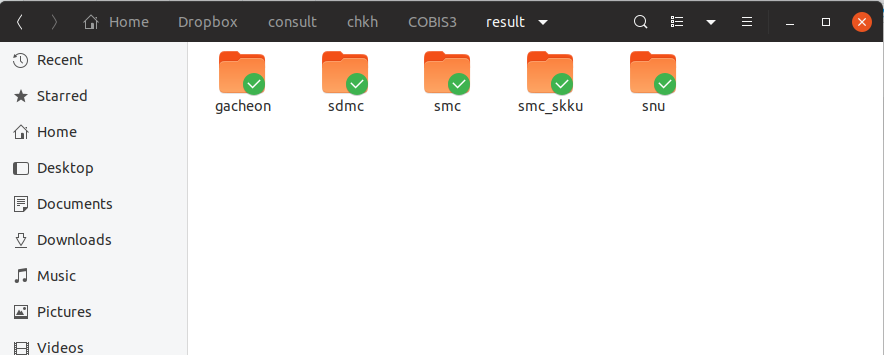

```{r setup, include=FALSE}
options(htmltools.dir.version = FALSE)
knitr::opts_chunk$set(echo = FALSE, fig.align = "center")
library(knitr);library(DT);library(dplyr);library(data.table);library(rmarkdown);library(readr);library(purrr);library(tidyr)
```


layout: true

<div class="my-footer"><span><a href="https://www.zarathu.com">Zarathu Co.,Ltd</a>   
&emsp;&emsp;&emsp;&emsp;&emsp;&emsp;&emsp;&emsp;&emsp;&emsp;&emsp;&emsp;&emsp;
&emsp;&emsp;&emsp;&emsp;&emsp;&emsp;&emsp;&emsp;&emsp;&emsp;&emsp;&emsp;&emsp;
<a href="https://github.com/jinseob2kim">김진섭</a></span></div> 


---
# Executive Summary 

.large[

* 의학연구자들에게 맞춤형 [ShinyApps](https://shiny.rstudio.com/)를 제공함.
    + 범용으로 쓰일만한 것들을 [Shiny module](https://shiny.rstudio.com/articles/modules.html)로 만든 후, [웹](http://app.zarathu.com)과 [RStudio Addins](https://github.com/jinseob2kim/jsmodule)로 배포.


* [심혈관중재학회](http://www.kscvi.org/new_ksic2015/community/main/kbc)와 계약, 1년간 [레지스트리](https://clinicaltrials.gov/ct2/show/NCT03068494) 연구에 대한 리포트를 제공 중(Rmarkdown 활용).


* [심평원](https://opendata.hira.or.kr/)/[보험공단](https://nhiss.nhis.or.kr/) 빅데이터 연구에서 Rmarkdown 리포트로 연구지원 중.


* [공통데이터모델(CDM) 정부과제](http://pf.kakao.com/_XsuxgC/34259783) 선정, 3년간 강동성심병원 소화기내과와 함께 [ATLAS](http://www.ohdsi.org/web/atlas) 활용한 위암/대장암 연구 수행예정.
]


---

class: center, middle

# ShinyApps


---
# 맞춤형 ShinyApps

* 안과 
    + 시야 데이터 분석
    
    + 국민건강영양조사 백내장/안검하수 연구
    

* 내과 
    + 심혈관 생리학 지표 계산 
    
    + 심혈관질환 위험 요인 생존분석
    
    + 대장암 위험 요인 생존분석
    
    + 타 연구결과 정리
    
    


* 정신건강의학과
    + 외상후 스트레스 장애 네트워크 분석


---
# 범용 ShinyApps

데이터 형태에 따라 3개로 따로 만듦. 기술통계, 회귀분석/생존분석, ROC 분석을 포함. 

* [일반 데이터](http://app.zarathu.com/basic)


* [반복측정 데이터](http://app.zarathu.com/repeated) - 한 사람이 여러번 측정함, [GEE](https://en.wikipedia.org/wiki/Generalized_estimating_equation) 기반의 분석 필요.


* [서베이(survey) 데이터](http://app.zarathu.com/survey) - 샘플가중치 존재(ex: 국건영)


* [프로펜시티 점수 분석]((http://app.zarathu.com/ps)(experimental)


---
# Rstudio Addin

자신의 컴퓨터에서 직접 수행할 수 있도록 [Rstudio Addin 포함한 패키지](https://github.com/jinseob2kim/jsmodule)로 배포, [CRAN](https://github.com/jinseob2kim/jsmodule) 등록됨 

```{r}
include_graphics("https://raw.githubusercontent.com/jinseob2kim/jsmodule/master/vignettes/figures/addin.gif")
```

---
# 개발 & 배포환경 

개발, 맞춤형 앱

* 대학원 서버에 [Docker 이미지](https://cloud.docker.com/u/jinseob2kim/repository/docker/jinseob2kim/docker-rshiny) 설치하여 기생.
    + R, Rstudio server, shiny server와 자주 쓰는 패키지를 미리 설치.
    

범용 앱 

* AWS에 [Docker swarm](https://github.com/jinseob2kim/swarm-setting) 환경 구축.
    + 부하정도에 따라 자동으로 인스턴스 추가/삭제. 현재 1대면 충분..
    
    
코드: [깃허브](https://github.com/jinseob2kim)

* R 패키지, Docker 이미지, 홈페이지/블로그는 public repository

* 맞춤형 앱은 private repository

    

---

class: center, middle

# Rmarkdown


---
# 레지스트리 연구 지원 

데이터는 하나, 10개 논문 목표, 5개 진행 중.

```{r}

```

---
# 심평원/보험공단 연구 지원

인터넷 연결(X), 리포트로 만들어서 반출 신청해야됨.


---

class: center, middle

# END


