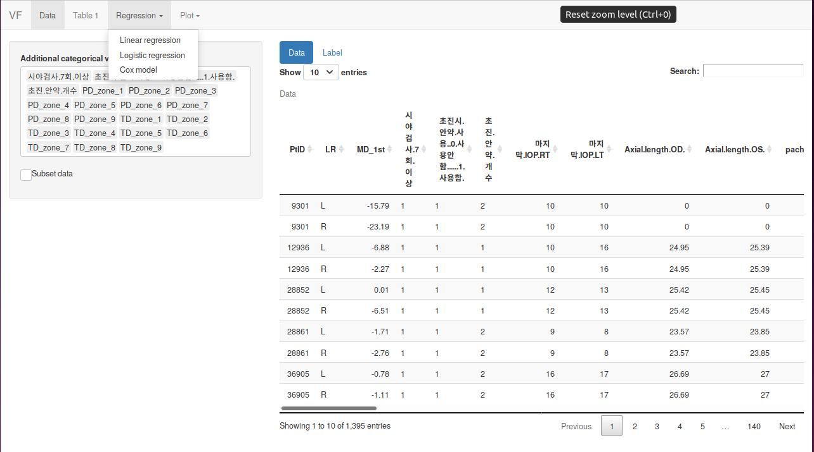
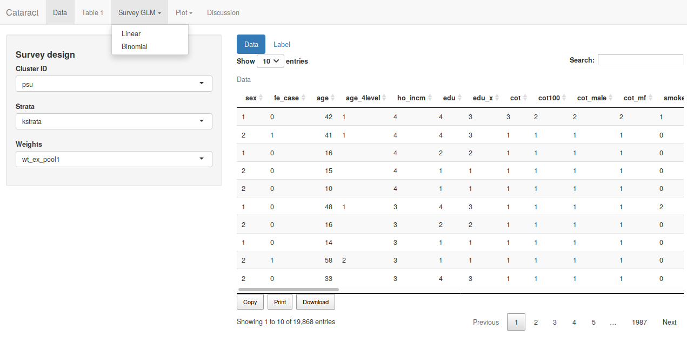
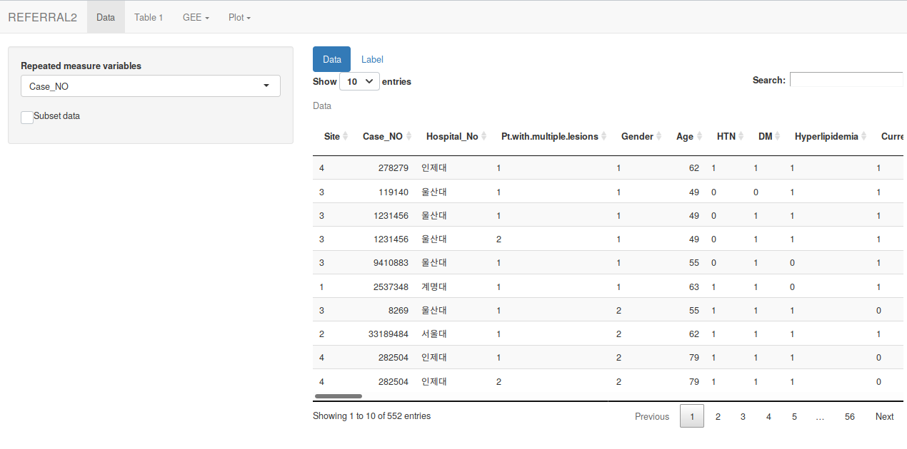
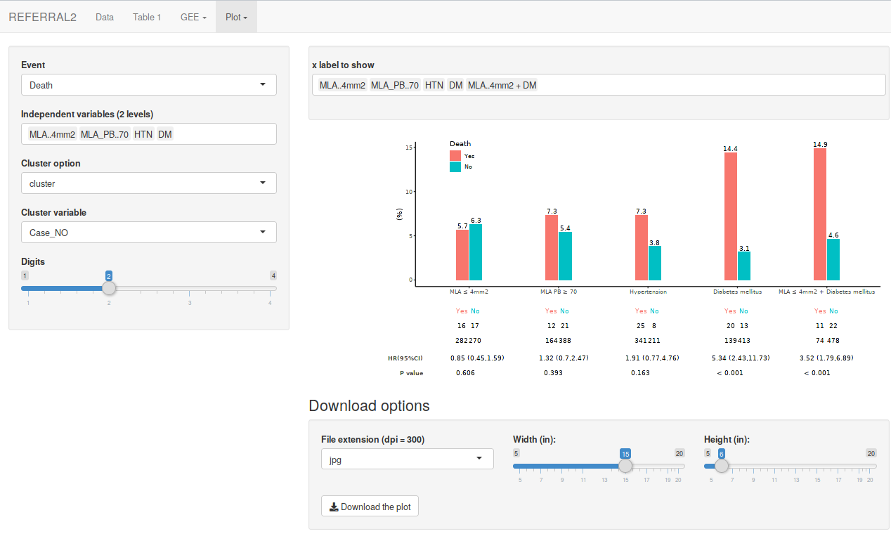
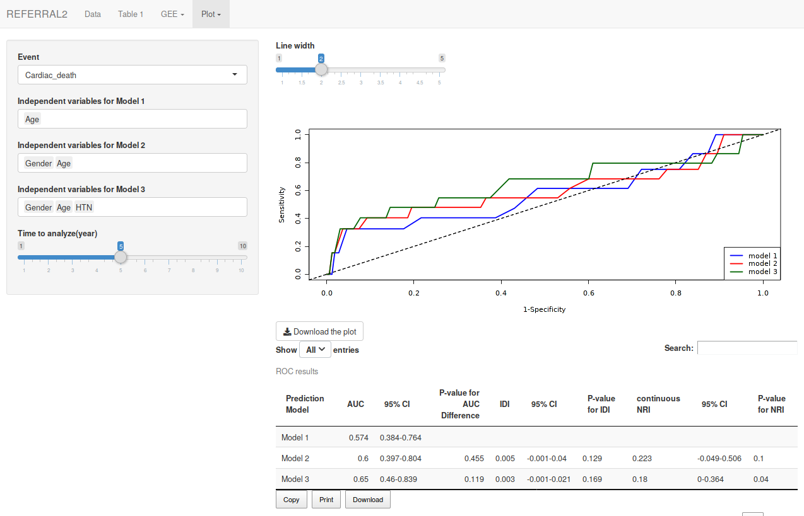
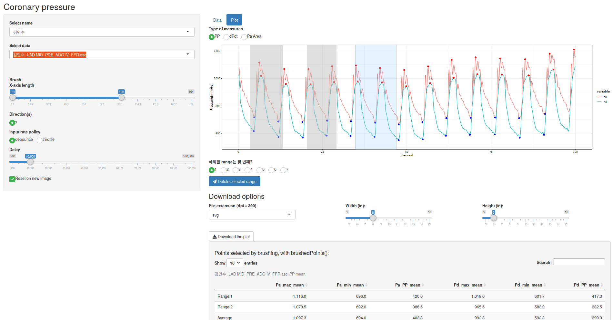
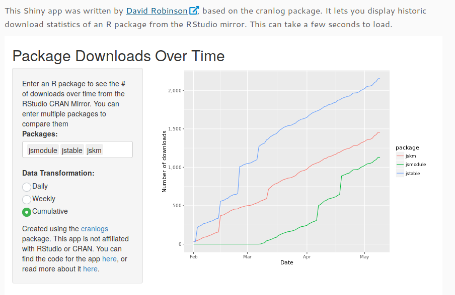
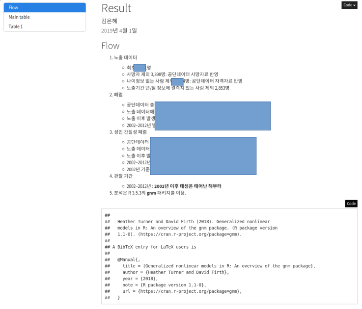

```{r setup, include=FALSE}
options(htmltools.dir.version = FALSE)
knitr::opts_chunk$set(echo = FALSE, fig.align = "center")
library(knitr);library(DT);library(dplyr);library(data.table);library(rmarkdown);library(readr);library(purrr);library(tidyr)
```


layout: true

<div class="my-footer"><span><a href="https://www.zarathu.com">Zarathu Co.,Ltd</a>   
&emsp;&emsp;&emsp;&emsp;&emsp;&emsp;&emsp;&emsp;&emsp;&emsp;&emsp;&emsp;&emsp;
&emsp;&emsp;&emsp;&emsp;&emsp;&emsp;&emsp;&emsp;&emsp;&emsp;&emsp;&emsp;&emsp;
<a href="https://github.com/jinseob2kim">김진섭</a></span></div> 


---
# Executive Summary 

.large[

* 의학연구자들에게 맞춤형 [ShinyApps](https://shiny.rstudio.com/)를 제공함.
    + 범용으로 쓰일만한 것들을 [Shiny module](https://shiny.rstudio.com/articles/modules.html)로 만든 후, [웹](http://app.zarathu.com)과 [RStudio Addins](https://github.com/jinseob2kim/jsmodule)로 배포.
]

--
.large[
* [심혈관중재학회](http://www.kscvi.org/new_ksic2015/community/main/kbc)와 계약, 1년간 [레지스트리](https://clinicaltrials.gov/ct2/show/NCT03068494) 연구에 대한 리포트를 제공 중(Rmarkdown 활용).
]

--
.large[
* [심평원](https://opendata.hira.or.kr/)/[보험공단](https://nhiss.nhis.or.kr/) 빅데이터 연구에서 Rmarkdown 리포트로 연구지원 중.
]


---

class: center, middle

# ShinyApps


---
# 맞춤형 ShinyApps

* 안과 
    + 시야 데이터 분석
    
    + 국민건강영양조사 백내장/안검하수 연구
    

* 내과 
    + 심혈관질환 위험 요인 생존분석
    
    + 심혈관 생리학 지표 계산 
    
    + 대장암 위험 요인 생존분석
    
    + 타 연구결과 정리
    
    


* 정신건강의학과
    + 외상후 스트레스 장애 네트워크 분석


---
# 시야데이터: 일반적인 통계

기술통계, 회귀/생존분석, 간단한 그림

[](http://app.zarathu.com)


---
# 국민건강영양조사

표본조사데이터: [survey](http://r-survey.r-forge.r-project.org/survey/) 패키지 적용, 표본가중치 고려한 통계

[](http://app.zarathu.com)


---
# 심혈관질환 위험요인

반복측정: [geepack](https://cran.r-project.org/web/packages/geepack/index.html) 패키지 적용, 한 사람이 2개 이상의 심혈관 시술 받음. 

[](http://app.zarathu.com)


---
# 맞춤형 그림

논문 맞춤형 [그림](https://ildiczeller.com/2018/02/11/downloadable-ggplots-in-shiny/)과 [테이블](https://rstudio.github.io/DT/extensions.html)을 다운로드


.pull-left[
[](http://app.zarathu.com)

]

.pull-right[
[](http://app.zarathu.com)
]
 
---
# 테이블 다운로드 예

[DT](https://rstudio.github.io/DT) 패키지의 `datatable` 함수

```{r, eval = F, echo= T}
datatable(
*   iris, extensions = 'Buttons', options = list(
*   dom = 'Bfrtip',  # Button, filter, processing, table, information, pagination                              
*   buttons = c('copy', 'csv', 'excel', 'pdf', 'print'),
    scrollX = T      # Scrolling X axis
  )
)
```

세부 `dom` 설정은 [여기](https://datatables.net/reference/option/dom) 

---

```{r}
datatable(
  iris, extensions = 'Buttons', options = list(
    dom = 'Bfrtip',  # Button, filter, processing, table, information, pagination                              
    buttons = c('copy', 'csv', 'excel', 'pdf', 'print'),
    scrollX = T      # Scrolling X axis
  )
)
```
---
# 심혈관 생리지표 계산

최대최소값 표시 & [드래그](https://shiny.rstudio.com/gallery/plot-interaction-advanced.html)한 부분의 생리지표를 계산

[](http://app.zarathu.com)

---
# PTSD 네트워크 분석

[qgraph](https://CRAN.R-project.org/package=qgraph) 패키지 이용. [colourpicker](https://github.com/daattali/colourpicker), [shinyWidgets](https://github.com/dreamRs/shinyWidgets) 패키지로 색상 선택 UI.

[](http://app.zarathu.com)


---
# 범용 ShinyApps

데이터 형태에 따라 3개로 따로 만듦. 기술통계, 회귀분석/생존분석, ROC 분석을 포함. 

* [일반 데이터](http://app.zarathu.com/basic)


* [반복측정 데이터](http://app.zarathu.com/repeated) - 한 사람이 여러번 측정함, [GEE](https://en.wikipedia.org/wiki/Generalized_estimating_equation) 기반의 분석 필요.


* [서베이(survey) 데이터](http://app.zarathu.com/survey) - 샘플가중치 존재(ex: 국건영)


* [프로펜시티 점수 분석]((http://app.zarathu.com/ps)(experimental)


---
# R 패키지: [jsmodule](https://github.com/jinseob2kim/jsmodule) 

자신의 컴퓨터에서 직접 수행할 수 있도록 [Rstudio Addin 포함한 패키지](https://github.com/jinseob2kim/jsmodule)로 배포, [CRAN](https://github.com/jinseob2kim/jsmodule) 등록됨 

```{r}
include_graphics("https://raw.githubusercontent.com/jinseob2kim/jsmodule/master/vignettes/figures/addin.gif")
```

---
## 패키지 다운로드 수

[](https://ipub.com/dev-corner/apps/r-package-downloads/)


---
# 개발 & 배포환경 

개발, 맞춤형 앱

* 대학원 서버에 [Docker 이미지](https://cloud.docker.com/u/jinseob2kim/repository/docker/jinseob2kim/docker-rshiny) 설치하여 기생.
    + R, Rstudio server, shiny server와 자주 쓰는 패키지를 미리 설치.
    
--

범용 앱

* AWS에 [Docker swarm](https://github.com/jinseob2kim/swarm-setting) 환경 구축.
    + 부하정도에 따라 자동으로 인스턴스 추가/삭제. 현재 1대면 충분..
    
--

코드: [깃허브](https://github.com/jinseob2kim)

* R 패키지, Docker 이미지, 홈페이지/블로그는 public repository

* 맞춤형 앱은 private repository


[RUCK2018 발표자료](https://blog.zarathu.com/posts/2018-11-08-ruck2018/)
    

---

class: center, middle

# Rmarkdown


---
# [레지스트리](http://pf.kakao.com/_XsuxgC/34113879) 연구 지원 

데이터는 하나, 5개 연구주제

```{r}
include_graphics("cobis.png")
```


원하는 논문테이블, 그림을 알려주면 제작.


* 테이블은 `knitr::kable`과 [kabelextra](https://cran.r-project.org/package=kableExtra) 패키지 이용.


---
# 테이블 예시

```{r, message=F, echo = T, eval = T}
library(knitr);library(kableExtra)
kable(mtcars[1:3, 1:6], row.names = T, caption = "Example", align = "c") %>% 
  kable_styling(full_width = F) %>%
  add_header_above(c("", "A" = 2, "B" = 4)) %>% 
  footnote(general = "Footnote")
```


---
# 심평원/보험공단 연구 지원

인터넷 연결(X), 리포트로 만들어서 반출 신청해야됨.

```{r, fig.cap="리포트"}

```

---
# 전부 SAS 파일

`haven::read_sas` 로 읽어야 함. 

```{r, eval = F, echo = T}
library(haven);library(dplyr)

## 월별 명세서 데이터
data.t20 <- list.files(pattern = "t20") %>% lapply(read_sas) %>% bind_rows 

## 월별 x-ray 데이터
data.xray <- list.files(pattern = "t30") %>% 
  lapply(function(x){
  read_sas(x) %>% filter(substr(MCARE_DIV_CD_ADJ, 1, 3) == "G21") %>% select(CMN_KEY, MCARE_DIV_CD_ADJ)}) %>% 
  bind_rows 
```


---

class: center, middle

# END


