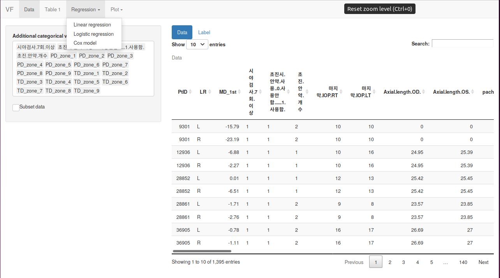
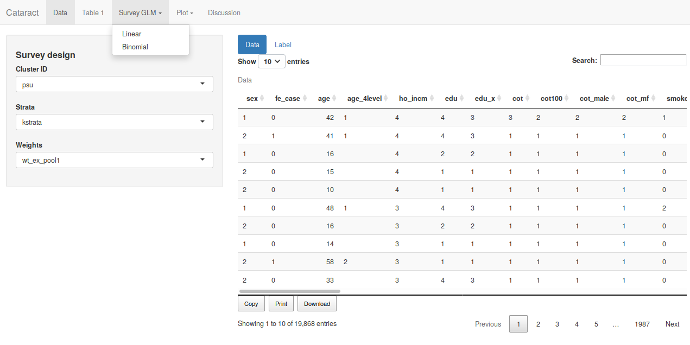
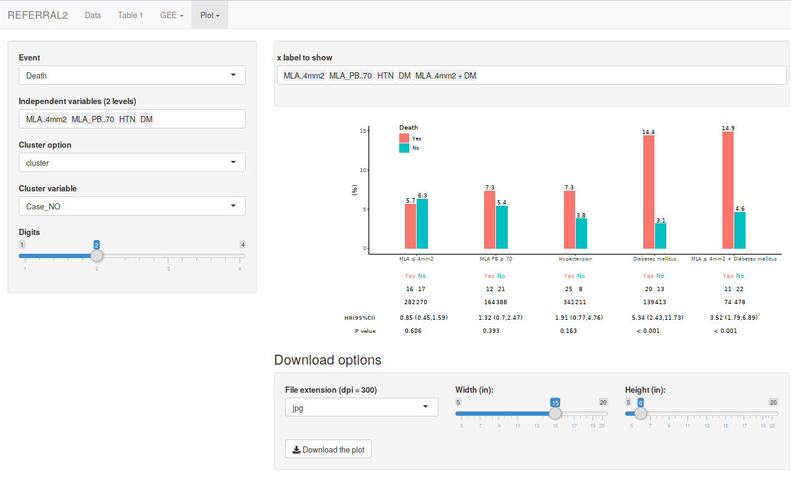
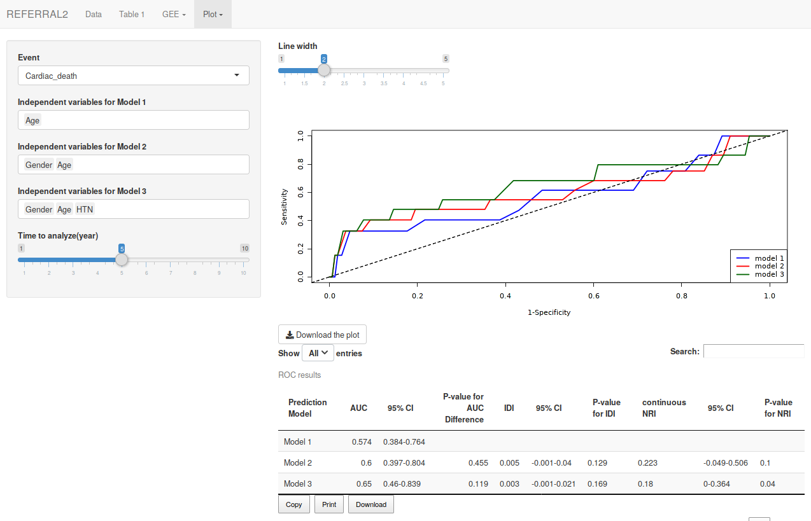

```{r setup, include=FALSE}
options(htmltools.dir.version = FALSE)
knitr::opts_chunk$set(echo = FALSE, fig.align = "center")
library(knitr);library(DT);library(dplyr);library(data.table);library(rmarkdown);library(readr);library(purrr);library(tidyr)
```


layout: true

<div class="my-footer"><span><a href="https://www.zarathu.com">Zarathu Co.,Ltd</a>   
&emsp;&emsp;&emsp;&emsp;&emsp;&emsp;&emsp;&emsp;&emsp;&emsp;&emsp;&emsp;&emsp;
&emsp;&emsp;&emsp;&emsp;&emsp;&emsp;&emsp;&emsp;&emsp;&emsp;&emsp;&emsp;&emsp;
<a href="https://github.com/jinseob2kim">김진섭</a></span></div> 


---
# Executive Summary 

.large[
* [R](https://www.r-project.org/)로 통계분석 뿐 아니라 [논문](https://github.com/rstudio/rticles), [발표 슬라이드](https://github.com/yihui/xaringan), [홈페이지](https://github.com/rstudio/blogdown), [블로그](https://rstudio.github.io/distill/), [웹 어플리케이션](https://shiny.rstudio.com/)을 만들 수 있다. 
]

--
.large[
* 의학연구자들에게 [맞춤형 통계 웹](http://app.zarathu.com)을 제공하는 것을 업으로 삼고 있다.


* 범용으로 쓰일만한 것들을 [웹](http://app.zarathu.com)과 [R 패키지](https://github.com/jinseob2kim/jsmodule)로 배포한다.
]


---

class: center, middle

# [R](https://www.r-project.org/)의 확장

---
# [R](https://www.r-project.org/)의 확장

[R](https://www.r-project.org/)은 이제 단순한 통계프로그램이 아님.

* [R Markdown](https://rmarkdown.rstudio.com/): 논문과 발표자료를 [R](https://www.r-project.org/) 에서 직접 만듦. [과거 정리 내용](https://blog.zarathu.com/posts/2019-01-03-rmarkdown/)

--

* [blogdown](https://github.com/rstudio/blogdown): 홈페이지도 만들 수 있음. 당사 홈페이지도 이것과 [distill](https://rstudio.github.io/distill/) 로 제작.

--

* [Shiny](https://shiny.rstudio.com/), [Shiny Server](https://www.rstudio.com/products/shiny/shiny-server/): 서버 구축하고 웹기반 앱을 만들 수 있음.

--

법인 설립 후 모든 작업에 [R](https://www.r-project.org/)을 이용함. 

---
# 논문 

[R](https://www.r-project.org/)에서 글, 그림, 테이블, 참고문헌까지 직접 작성. 
 
* [rticles](https://github.com/rstudio/rticles): 대부분 학술지의 템플릿을 포함.

```{r, fig.align='center', out.width= "50%"}
include_graphics("https://bookdown.org/yihui/rmarkdown/images/rticles-templates.png")
```

[준비하던 박사논문](https://blog.zarathu.com/posts/2018-11-08-mdlm/)  

---
# 발표 슬라이드

논문쓸 때 이용했던 R 코드 활용, 빠르게 발표 슬라이드 제작 가능.

* [기본 템플릿](https://rmarkdown.rstudio.com/lesson-11.html), [xaringan](https://github.com/yihui/xaringan) 패키지: 이 슬라이드도 [xaringan](https://github.com/yihui/xaringan)으로 제작.

```{r, out.width= "80%"}
include_graphics("https://user-images.githubusercontent.com/163582/53144527-35f7a500-3562-11e9-862e-892d3fd7036d.gif")
```


---
# 홈페이지

[blogdown](https://github.com/rstudio/blogdown), [distill](https://rstudio.github.io/distill/): [깃허브](https://pages.github.com/) 통해 무료 웹호스팅 가능.

```{r, out.width= "80%"}
include_graphics("https://www.storybench.org/wp-content/uploads/2019/05/blogdown-new-site-e1557149319624-730x457.png")
```

[홈페이지](https://github.com/zarathucorp/zarathu), [블로그](https://github.com/zarathucorp/blog)


---
# 웹 앱

[Shiny](https://shiny.rstudio.com/): [R](https://www.r-project.org/) 코드만으로 웹앱 제작

```{r}
include_graphics("https://shiny.rstudio.com/images/debugging/kmeans-showcase.gif")
```


---
# 웹 서버

[Shiny Server](https://www.rstudio.com/products/shiny/shiny-server/): [Shiny](https://shiny.rstudio.com/)를 서버에서 구동.

```{r}
include_graphics("https://shiny.rstudio.com/images/shiny-server-pro.png")
```

[Zarathu app](http://app.zarathu.com)


---

class: center, middle

# 맞춤형 서비스


---
# 맞춤형 웹

* 안과 
    + 시야 데이터 분석
    
    + 국민건강영양조사 백내장/안검하수 연구
    

* 내과 
    + 심혈관질환 위험 요인 생존분석
    
    + 심혈관 생리학 지표 계산 
    
    + 대장암 위험 요인 생존분석
    
    + 타 연구결과 정리
    
    


* 정신건강의학과
    + 외상후 스트레스 장애 네트워크 분석


---
# 시야데이터: 일반적인 통계

기술통계, 회귀/생존분석, 간단한 그림

[](http://app.zarathu.com)


---
# 국민건강영양조사

표본조사데이터: [survey](http://r-survey.r-forge.r-project.org/survey/) 패키지 적용, 표본가중치 고려한 통계

[](http://app.zarathu.com)


---
# 심혈관질환 위험요인

반복측정: [geepack](https://cran.r-project.org/web/packages/geepack/index.html) 패키지 적용, 한 사람이 2개 이상의 심혈관 시술 받음. 

[](http://app.zarathu.com)


---
# 맞춤형 그림

논문 맞춤형 [그림](https://ildiczeller.com/2018/02/11/downloadable-ggplots-in-shiny/)과 [테이블](https://rstudio.github.io/DT/extensions.html)을 다운로드


.pull-left[
[](http://app.zarathu.com)

]

.pull-right[
[](http://app.zarathu.com)
]


---
# PPT에서 편집: `emf` 확장자

**PPT** 정확한 그림인식 위해 **emfPlus = F** 옵션 필수!

```{r, echo = T, eval = F}
library(devEMF)
emf("plot.emf", width = 7, height = 7, emfPlus = F)
ggplot(mtcars, aes(mpg, cyl)) + geom_point()
dev.off()
```

```{r, out.width= "70%"}
include_graphics("zzz.png")
```

---
# 테이블 다운로드 예

[DT](https://rstudio.github.io/DT) 패키지의 `datatable` 함수

```{r, eval = F, echo= T}
datatable(
*   iris, extensions = 'Buttons', options = list(
*   dom = 'Bfrtip',  # Button, filter, processing, table, information, pagination                              
*   buttons = c('copy', 'csv', 'excel', 'pdf', 'print'),
    scrollX = T      # Scrolling X axis
  )
)
```

세부 `dom` 설정은 [여기](https://datatables.net/reference/option/dom) 

---

```{r}
datatable(
  iris, extensions = 'Buttons', options = list(
    dom = 'Bfrtip',  # Button, filter, processing, table, information, pagination                              
    buttons = c('copy', 'csv', 'excel', 'pdf', 'print'),
    scrollX = T      # Scrolling X axis
  )
)
```
---
# 심혈관 생리지표 계산

최대최소값 표시 & [드래그](https://shiny.rstudio.com/gallery/plot-interaction-advanced.html)한 부분의 생리지표를 계산

[](http://app.zarathu.com)

---
# PTSD 네트워크 분석

[qgraph](https://CRAN.R-project.org/package=qgraph) 패키지 이용. [colourpicker](https://github.com/daattali/colourpicker), [shinyWidgets](https://github.com/dreamRs/shinyWidgets) 패키지로 색상 선택 UI.

[](http://app.zarathu.com)


---

class: center, middle

# 범용 서비스

---
# 직접 데이터 업로드해서 이용

데이터 형태에 따라 3개로 따로 만듦. 기술통계, 회귀분석/생존분석, ROC 분석을 포함. 

* [일반 데이터](http://app.zarathu.com/basic)


* [반복측정 데이터](http://app.zarathu.com/repeated) - 한 사람이 여러번 측정함, [GEE](https://en.wikipedia.org/wiki/Generalized_estimating_equation) 기반의 분석 필요.


* [서베이(survey) 데이터](http://app.zarathu.com/survey) - 샘플가중치 존재(ex: 국건영)


* [프로펜시티 점수 분석]((http://app.zarathu.com/ps)(experimental)


---
# R 패키지: [jsmodule](https://github.com/jinseob2kim/jsmodule) 

자신의 컴퓨터에서 직접 수행할 수 있도록 [Rstudio Addin 포함한 패키지](https://github.com/jinseob2kim/jsmodule)로 배포, [CRAN](https://cran.r-project.org/package=jsmodule) 등록됨. 그 외, 생존분석 그림을 위한 [jskm](https://cran.r-project.org/package=jskm), 회귀분석 테이블을 만드는 [jstable](https://cran.r-project.org/package=jstable) 

```{r}
include_graphics("https://raw.githubusercontent.com/jinseob2kim/jsmodule/master/vignettes/figures/addin.gif")
```


---
## 패키지 다운로드 수


<iframe src="https://shinyus.ipub.com/cranview/" width="100%" height="80%" frameborder="0" allowfullscreen></iframe>


---
# 개발 & 배포환경 

개발, 맞춤형 앱

* 대학원 서버에 [Docker 이미지](https://cloud.docker.com/u/jinseob2kim/repository/docker/jinseob2kim/docker-rshiny) 설치하여 기생.
    + R, Rstudio server, shiny server와 자주 쓰는 패키지를 미리 설치.
    
--

범용 앱

* AWS에 [Docker swarm](https://github.com/jinseob2kim/swarm-setting) 환경 구축.
    + 부하정도에 따라 자동으로 인스턴스 추가/삭제. 현재 1대면 충분..
    
--

코드: [깃허브](https://github.com/jinseob2kim)

* R 패키지, Docker 이미지, 홈페이지/블로그는 public repository

* 맞춤형 앱은 private repository


[RUCK2018 발표자료](https://blog.zarathu.com/posts/2018-11-08-ruck2018/)
    


---
# Executive Summary 

.large[
* [R](https://www.r-project.org/)로 통계분석 뿐 아니라 [논문](https://github.com/rstudio/rticles), [발표 슬라이드](https://github.com/yihui/xaringan), [홈페이지](https://github.com/rstudio/blogdown), [블로그](https://rstudio.github.io/distill/), [웹 어플리케이션](https://shiny.rstudio.com/)을 만들 수 있다. 


* 의학연구자들에게 [맞춤형 통계 웹](http://app.zarathu.com)을 제공하는 것을 업으로 삼고 있다.


* 범용으로 쓰일만한 것들을 [웹](http://app.zarathu.com)과 [R 패키지](https://github.com/jinseob2kim/jsmodule)로 배포한다.

]


---

class: center, middle

# END


