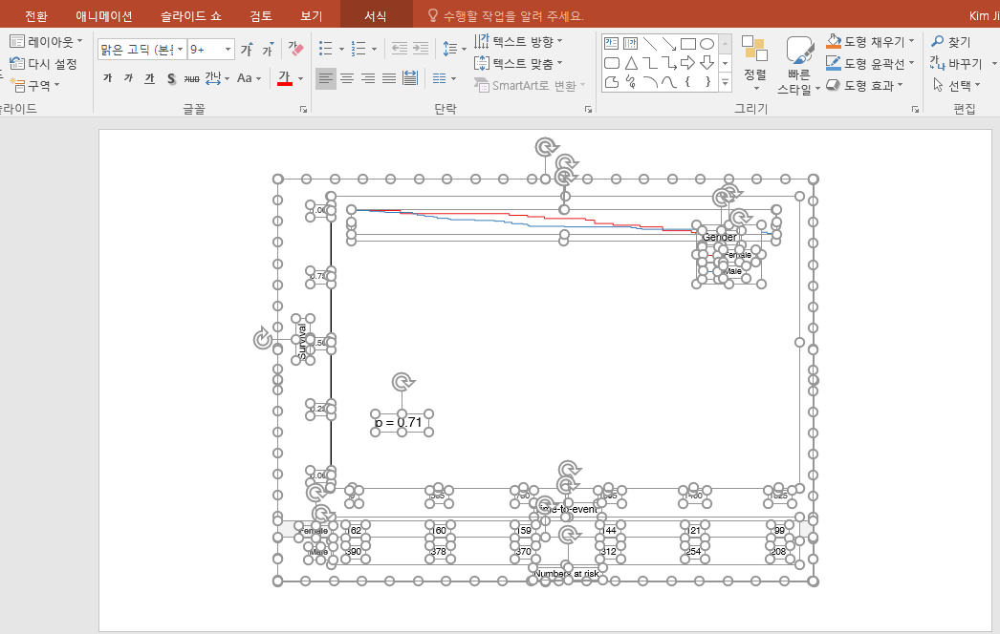

```{r setup, include=FALSE}
options(htmltools.dir.version = FALSE)
knitr::opts_chunk$set(echo = FALSE, fig.align = "center", message = F, warning = F)
library(knitr);library(DT);library(dplyr);library(data.table);library(rmarkdown);library(readr);library(purrr);library(tidyr)
```


layout: true

<div class="my-footer"><span><a href="https://www.zarathu.com">Zarathu Co.,Ltd</a>   
&emsp;&emsp;&emsp;&emsp;&emsp;&emsp;&emsp;&emsp;&emsp;&emsp;&emsp;&emsp;&emsp;
&emsp;&emsp;&emsp;&emsp;&emsp;&emsp;&emsp;&emsp;&emsp;&emsp;&emsp;&emsp;&emsp;
<a href="https://github.com/jinseob2kim">조선니체</a></span></div> 


---
# Executive Summary 

.large[
* [R](https://www.r-project.org/)로 통계분석 뿐 아니라 [논문](https://github.com/rstudio/rticles), [발표 슬라이드](https://github.com/yihui/xaringan), [홈페이지](https://github.com/rstudio/blogdown), [블로그](https://rstudio.github.io/distill/), [웹 어플리케이션](https://shiny.rstudio.com/)을 만들 수 있다. 
]

--
.large[

* 의학연구자들에게 [맞춤형 통계 웹](http://app.zarathu.com)을 제공.


* 범용으로 쓰일만한 것들을 [웹](http://app.zarathu.com)과 [R 패키지](https://github.com/jinseob2kim/jsmodule)로 배포.

]


--
.large[
모임 소개 

* [`r anicon::faa('github', animate='float', rtext='shinykorea')`](https://github.com/shinykorea/Meetup) 밋업 후원: [R](https://www.r-project.org/) 웹만들기 지식 공유


* 카카오 오픈채팅: 프로그래밍 갤러리 R사용자 모임
]

---
# 주요 경험 

.large[

* 수학 올림피아드


* 의과대학: **임상** 데이터


* 보건대학원: **유전체** 데이터


* 삼성전자 무선사업부: **모바일헬스** 데이터
]

--
.large[

의학연구지원법인 [차라투](https://www.zarathu.com) 설립 

* **다양한 건강데이터를 다뤄본 경험**으로 맞춤형 의료데이터 분석 지원
]


---

class: center, middle

# [R](https://www.r-project.org/)의 확장

---
# [R](https://www.r-project.org/)의 확장

[R](https://www.r-project.org/)은 이제 단순한 통계프로그램이 아님.

* [R Markdown](https://rmarkdown.rstudio.com/): 논문과 발표자료를 [R](https://www.r-project.org/) 에서 직접 만듦. [과거 정리 내용](https://blog.zarathu.com/posts/2019-01-03-rmarkdown/)

--

* [blogdown](https://github.com/rstudio/blogdown): 홈페이지도 만들 수 있음. 당사 홈페이지도 이것과 [distill](https://rstudio.github.io/distill/) 로 제작.

--

* [Shiny](https://shiny.rstudio.com/), [Shiny Server](https://www.rstudio.com/products/shiny/shiny-server/): 서버 구축하고 웹기반 앱을 만들 수 있음.

--

법인 설립 후 모든 작업에 [R](https://www.r-project.org/)을 이용함. 

---
# 논문 

[R](https://www.r-project.org/)에서 글, 그림, 테이블, 참고문헌까지 직접 작성. 
 
* [rticles](https://github.com/rstudio/rticles): 대부분 학술지의 템플릿을 포함.

```{r, fig.align='center', out.width= "50%"}
include_graphics("https://bookdown.org/yihui/rmarkdown/images/rticles-templates.png")
```

[준비하던 박사논문](https://blog.zarathu.com/posts/2018-11-08-mdlm/)  

---
# 발표 슬라이드

논문쓸 때 이용했던 R 코드 활용, 빠르게 발표 슬라이드 제작 가능.

* [기본 템플릿](https://rmarkdown.rstudio.com/lesson-11.html), [xaringan](https://github.com/yihui/xaringan) 패키지: 이 슬라이드도 [xaringan](https://github.com/yihui/xaringan)으로 제작.

```{r, out.width= "80%"}
include_graphics("https://user-images.githubusercontent.com/163582/53144527-35f7a500-3562-11e9-862e-892d3fd7036d.gif")
```


---
# 홈페이지

[blogdown](https://github.com/rstudio/blogdown), [distill](https://rstudio.github.io/distill/): [깃허브](https://pages.github.com/) 통해 무료 웹호스팅 가능.

```{r, out.width= "80%"}
include_graphics("https://www.storybench.org/wp-content/uploads/2019/05/blogdown-new-site-e1557149319624-730x457.png")
```

[홈페이지](https://github.com/zarathucorp/zarathu), [블로그](https://github.com/zarathucorp/blog)


---
# 웹 앱

[Shiny](https://shiny.rstudio.com/): [R](https://www.r-project.org/) 코드만으로 웹앱 제작

```{r}
include_graphics("https://shiny.rstudio.com/images/debugging/kmeans-showcase.gif")
```

---
# 웹 대시보드 

[shinydashboard](https://rstudio.github.io/shinydashboard/), [flexdashboard](https://rmarkdown.rstudio.com/flexdashboard/) 등

<center>
<a href="https://rmarkdown.rstudio.com/flexdashboard"></a>
</center>


---
# 웹 서버

[Shiny Server](https://www.rstudio.com/products/shiny/shiny-server/): [Shiny](https://shiny.rstudio.com/)를 서버에서 구동.

```{r}
include_graphics("https://shiny.rstudio.com/images/shiny-server-pro.png")
```

[Zarathu app](http://app.zarathu.com)


---

class: center, middle

# 맞춤형 서비스


---
# 전문적인 통계분석

* 외과
    + 신장이식 연구
    
    

* 내과 
    + 심혈관질환 위험 요인 생존분석
    
    + 심혈관 생리학 지표 계산 
    
    + 국민건강영양조사 신장 기능 연구
    

* 정신건강의학과
    + 외상후 스트레스 장애 네트워크 분석


---
# 신장이식

기술통계, 회귀/생존분석, 맞춤형 그림

[](http://app.zarathu.com)


---
# 심혈관질환 위험요인

반복측정, 한 사람이 2개 이상의 심혈관 시술 받음. 

[](http://app.zarathu.com)


---
# PPT에서 편집: `emf` 확장자

**PPT** 정확한 그림인식 위해 **emfPlus = F** 옵션 필수!

```{r, echo = T, eval = F}
library(devEMF)
emf("plot.emf", width = 7, height = 7, emfPlus = F)
ggplot(mtcars, aes(mpg, cyl)) + geom_point()
dev.off()
```

```{r, out.width= "70%"}

```

---
# 테이블 다운로드 예

[DT](https://rstudio.github.io/DT) 패키지의 `datatable` 함수

```{r, eval = F, echo= T}
datatable(
*   iris, extensions = 'Buttons', options = list(
*   dom = 'Bfrtip',  # Button, filter, processing, table, information, pagination                              
*   buttons = c('copy', 'csv', 'excel', 'pdf', 'print'),
    scrollX = T      # Scrolling X axis
  )
)
```

세부 `dom` 설정은 [여기](https://datatables.net/reference/option/dom) 

---

```{r}
datatable(
  iris, extensions = 'Buttons', options = list(
    dom = 'Bfrtip',  # Button, filter, processing, table, information, pagination                              
    buttons = c('copy', 'csv', 'excel', 'pdf', 'print'),
    scrollX = T      # Scrolling X axis
  )
)
```
---
# 심혈관 생리지표 계산

최대최소값 표시 & [드래그](https://shiny.rstudio.com/gallery/plot-interaction-advanced.html)한 부분의 생리지표를 계산

[](http://app.zarathu.com)

---
# PTSD 네트워크 분석

[qgraph](https://CRAN.R-project.org/package=qgraph) 패키지 이용. [colourpicker](https://github.com/daattali/colourpicker), [shinyWidgets](https://github.com/dreamRs/shinyWidgets) 패키지로 색상 선택 UI.

[](http://app.zarathu.com)


---
# 대시보드

* 미세먼지 데이터 [웹 크롤링](https://jinseob2kim.github.io/LectureRpackage/RSelenium/) 후 [대시보드](https://github.com/zarathucorp/kweatherdashboard) 만들기


[](http://app.zarathu.com)


---

class: center, middle

# 범용 서비스

---
# 공개 웹


.large[
직접 데이터 업로드, 기술통계, 회귀분석/생존분석, ROC 분석. 

* [일반 데이터](http://app.zarathu.com/basic)


* [반복측정 데이터](http://app.zarathu.com/repeated) - 한 사람이 여러번 측정함


* [서베이(survey) 데이터](http://app.zarathu.com/survey) - 샘플가중치 존재(ex: 국건영)


* [프로펜시티 점수 분석]((http://app.zarathu.com/ps)(experimental)
]


---
# R 패키지 개발

3개의 패키지를 [CRAN](https://cran.r-project.org/)에 배포.

- [jstable](https://github.com/jinseob2kim/jstable): 논문용 테이블 만들기 

- [jskm](https://github.com/jinseob2kim/jskm): kaplan-meier 생존곡선 그리기

- [jsmodule](https://github.com/jinseob2kim/jsmodule): 위 2 패키지를 적용한 통계분석 웹

--

<center><a href="https://ipub.com/dev-corner/apps/r-package-downloads/"></a></center>

[RUCK 2019 발표](https://ruck2019.r-kor.org/speakers/zarathu/)

---
# [jstable](https://github.com/jinseob2kim/jstable): table 1

```r
library(jstable)
*tb1 <- CreateTableOneJS(names(mtcars), strata = "vs", data = mtcars, factorVars = c("vs", "am", "gear", "carb"))
datatable(tb1$table[, -6], caption = tb1$caption)
```

```{r, echo = F}
library(jstable)
tb1 <- CreateTableOneJS(names(mtcars), strata = "vs", data = mtcars, factorVars = c("vs", "am", "gear", "carb"))
datatable(tb1$table[, -6], caption = tb1$caption, options = list(pageLength = 5))
```

---
# [jstable](https://github.com/jinseob2kim/jstable): regression

```r
model.logisic <- glm(vs ~ wt + qsec, data = mtcars)
*res.logistic <- glmshow.display(model.logisic)
*out.logistic <- LabelepiDisplay(res.logistic)
datatable(out.logistic, caption = res.logistic$first.line)
```

```{r, echo=F}
model.logisic <- glm(vs ~ wt + qsec, data = mtcars)
res.logistic <- glmshow.display(model.logisic)
out.logistic <- LabelepiDisplay(res.logistic)
datatable(out.logistic, caption = res.logistic$first.line, options = list(dom = 'rt'))
```

---
# [jskm](https://github.com/jinseob2kim/jskm)

```{r, fig.width= 8, fig.height= 5}
library(jskm);library(survival)
fit <- survfit(Surv(time, status) ~ rx, data = colon)
jskm(fit, timeby=365, marks = F, pval = T, table = T)
```


---
# [jsmodule](https://github.com/jinseob2kim/jsmodule)

<center>
<figure>
<a href="https://github.com/jinseob2kim/jsmodule"></a>
<figurecaption>Rstudio Addins: jsmodule packages</figurecaption>
</figure>
</center>


통계분석 웹 : http://app.zarathu.com/


---

class: center, middle

# 기타 

---
# 개발 & 배포환경 

개발, 맞춤형 앱

* 대학원 서버에 [Docker 이미지](https://cloud.docker.com/u/jinseob2kim/repository/docker/jinseob2kim/docker-rshiny) 설치하여 기생.
    + R, Rstudio server, shiny server와 자주 쓰는 패키지를 미리 설치.
    
--

범용 앱

* AWS에 [Docker swarm](https://github.com/jinseob2kim/swarm-setting) 환경 구축.
    + 부하정도에 따라 자동으로 인스턴스 추가/삭제. 현재 1대면 충분..
    
--

코드: [깃허브](https://github.com/jinseob2kim)

* R 패키지, Docker 이미지, 홈페이지/블로그는 public repository

* 맞춤형 앱은 private repository


[RUCK2018 발표자료](https://blog.zarathu.com/posts/2018-11-08-ruck2018/)
    
---
# [shinykorea](https://github.com/shinykorea/Meetup) 밋업 

.large[
매달 모여 shiny 지식 공유. 
]

<center>
<a href="https://github.com/jinseob2kim/shinykorea/Meetup"></a>
</center>


---
# 오픈채팅

.large[
프로그래밍 갤러리 R사용자 모임
]


<center></center>

---
# Executive Summary 

.large[
* [R](https://www.r-project.org/)로 통계분석 뿐 아니라 [논문](https://github.com/rstudio/rticles), [발표 슬라이드](https://github.com/yihui/xaringan), [홈페이지](https://github.com/rstudio/blogdown), [블로그](https://rstudio.github.io/distill/), [웹 어플리케이션](https://shiny.rstudio.com/)을 만들 수 있다. 


* 의학연구자들에게 [맞춤형 통계 웹](http://app.zarathu.com)을 제공.


* 범용으로 쓰일만한 것들을 [웹](http://app.zarathu.com)과 [R 패키지](https://github.com/jinseob2kim/jsmodule)로 배포.


모임 소개 

* [`r anicon::faa('github', animate='float', rtext='shinykorea')`](https://github.com/shinykorea/Meetup) 밋업 후원: [R](https://www.r-project.org/) 웹만들기 지식 공유


* 카카오 오픈채팅: 프로그래밍 갤러리 R사용자 모임
]


---

class: center, middle

# END


