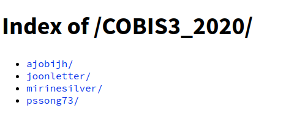
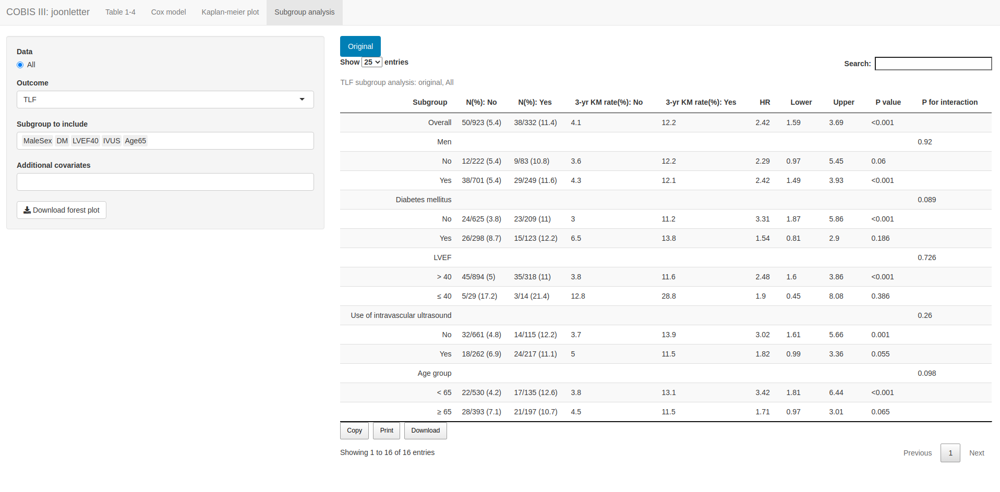
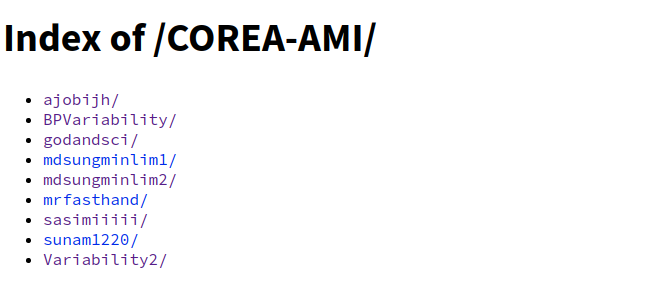
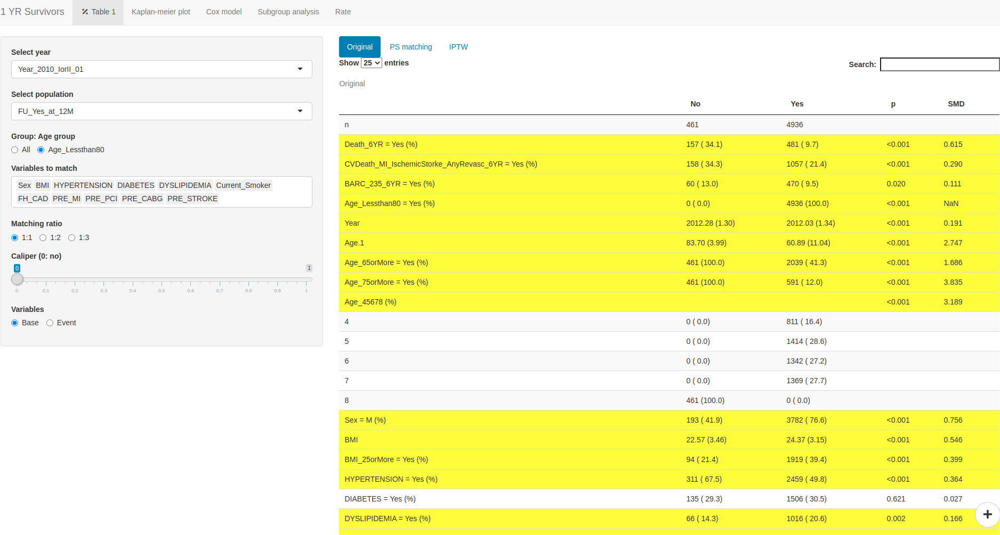
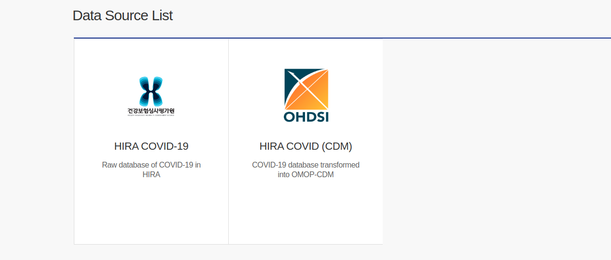
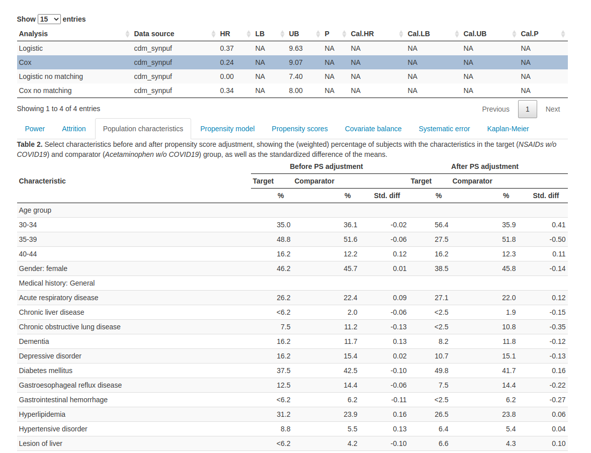
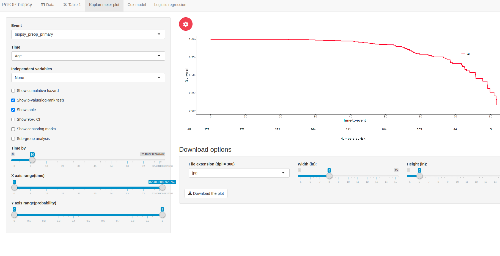
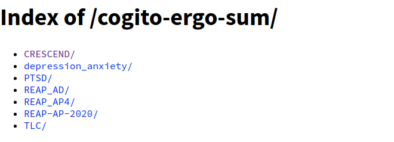
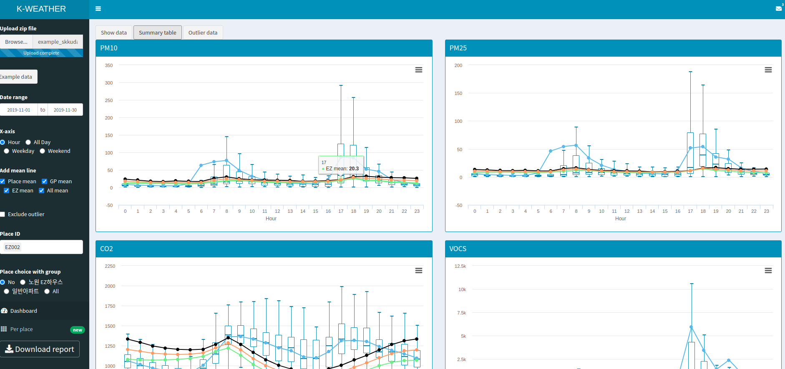

```{r setup, include=FALSE}
options(htmltools.dir.version = FALSE)
knitr::opts_chunk$set(echo = T, fig.align = "center", message = F, warning = F)
library(knitr);library(DT);library(dplyr);library(data.table);library(rmarkdown);library(readr);library(purrr);library(tidyr)
```


layout: true

<div class="my-footer"><span><a href="https://www.zarathu.com">Zarathu Co.,Ltd</a>   
&emsp;&emsp;&emsp;&emsp;&emsp;&emsp;&emsp;&emsp;&emsp;&emsp;&emsp;&emsp;&emsp;
&emsp;&emsp;&emsp;&emsp;&emsp;&emsp;&emsp;&emsp;&emsp;&emsp;&emsp;&emsp;&emsp;
<a href="https://github.com/jinseob2kim">김진섭</a></span></div> 


---
# Executive Summary 


- 대한심혈관중재학회 [COBIS III 레지스트리](https://clinicaltrials.gov/ct2/show/NCT03068494) 분석: [추가계약](http://pf.kakao.com/_XsuxgC/48388190)


- 서울성모병원 [COREA-AMI II 레지스트리](https://clinicaltrials.gov/ct2/show/NCT02806102) 분석: [10개 연구 계약](http://pf.kakao.com/_XsuxgC/48043955)


- 삼성서울병원 [공통데이터모델(CDM)](http://www.feedernet.org/html/?pmode=cdmdrn) 분석: [심평원 코로나데이터](https://hira-covid19.net/) 분석 중 


- 강동성심병원 위암 위험인자 분석: 공단표본데이터 분석 중 


- 경기도감염병관리지원단 코로나 대시보드 with Shinykorea: [최종보고](https://shinykorea.github.io/corona-activityrecord) 


- 삼성서울병원 이식외과 육종(sarcoma) 데이터 분석: [5개 연구 계약](http://pf.kakao.com/_XsuxgC/51701089) 


- 해운대백병원 정신질환 네트워크분석: [논문 4편](http://pf.kakao.com/_XsuxgC/52664370) 게재


- 성균관의대 환경역학연구실 [미세먼지 대시보드](http://pf.kakao.com/_XsuxgC/43627405)

--

.large[
Shiny로 연구용 환자정보 입력웹(Electronic Case Report Forms, eCRF) 만들어 분석모듈 앞에 붙이고 싶습니다.
]

---
# 지원사업 선정

- [인공지능 고성능 컴퓨팅 지원(NIPA)](http://pf.kakao.com/_XsuxgC/47697531): 램 170기가 GPU 서버 내년 2월까지 이용. 강동성심병원 공단표본데이터 분석에 이용


- [클라우드 기반 SW개발환경 지원(NIPA)](http://pf.kakao.com/_XsuxgC/45852850): KT 클라우드 720만원 쿠폰, http://app.zarathu.com 운영 중. 


- [공개 SW커뮤니티 자원](http://pf.kakao.com/_XsuxgC/46167561): Shinykorea 모임장소, 토즈이용요금

--

- 초기창업패키지 1차 탈락...


---

# COBIS III

- 작년 10개 연구 계약, 올해 5개 추가 진행 중 



- Prpensity score 매칭, IPTW 가중치 

- Table 1, 생존분석, 생존곡선 

- 서브그룹분석, forestplot


---




---
# COREA-AMI II

- 1년간 10개 연구 계약 



- Prpensity score 매칭, IPTW 가중치 

- Table 1, 생존분석, 생존곡선 

- 서브그룹분석, forestplot

---



---
# 공통데이터모델(CDM)

- 병원들의 **데이터형태를 통일**하면, 분석코드 하나로 여러 병원의 분석이 가능.


- **분석코드가 R** 패키지형태로 만들어지고, **결과는 shiny** 로 보여짐.


- 심평원 코로나데이터가 CDM 형태로도 제공되어 삼성서울병원 연구진과 분석 중.


---



--- 
# 공단표본데이터 위암 연구 

- 강동성심병원 내과와 공동연구 


- 데이터 100기가 이상, RAM 이 커야함. 지원받은 인공지능 고성능 서버 이용.


분석모듈 

- Prpensity score 매칭, IPTW 가중치 

- Table 1, 생존분석, 생존곡선 

- 서브그룹분석, forestplot


---
# 코로나 대시보드

- 경기도감염병관리지원단 의뢰, with Shinykorea 


고려사항 

- 보안: 로그인, Dropbox/구글시트 접근권한

- 이용자 의견 반영한 색상, 그래프, 테이블

- 경기도 색상과 폰트 적용

- 리포트 다운기능: pdf/word 각각


---
# 개발 1: [병상관리 대시보드](https://github.com/shinykorea/corona-sickbed)


---
# 병상관리 대시보드 요약

.large[
https://github.com/shinykorea/corona-sickbed

- 목표: 경기도 병원 및 생활치료센터의 가용병상 현황을 보여주는 대시보드를 개발, 중증환자 입원에 대한 긴급대책단의 의사결정을 돕는다.

- 정부제공 서버에 배포 중

- 주요 기능: **로그인, Dropbox 연계 엑셀파일 업데이트, 병상현황 그래프/지도, 리포트 다운로드(pdf/word)**

]


---
# 개발 2: [확진자 건강관리](https://github.com/shinykorea/corona-triage)


---


---
# 확진자 건강관리 요약 

.large[
https://github.com/shinykorea/corona-triage

- 목표: Covid-19 확진자를 중증도에 따라 분류, 의료자원을 고려한 치료 전략에 도움을 준다.

- 현재 정부지원 서버에 배포 중

- 주요 기능: **로그인, 구글 시트 연계 엑셀파일 업데이트, 구글 설문지 동기화, 전체 환자/센터별/개인별 상세 정보, 그래프**
]


---
# 육종(sarcoma) 데이터 분석 

- [삼성서울병원 이식외과](http://pf.kakao.com/_XsuxgC/51701089)


- 데이터정리, Shiny 분석웹 제공 


- 현재 2개 연구 진행 중


분석모듈

- Table 1

- 로지스틱 회귀분석, 생존분석, 생존곡선 


---



---
# 정신질환 네트워크 분석 

- 작년부터 with 해운대백병원 정신과 


- [qgraph](http://sachaepskamp.com/qgraph/examples) 패키지 이용, 네트워크분석웹 개발 



---


---
# 미세먼지 대시보드

- 성균관의대 환경역학연구실 의뢰 


- 신축아파트에 미세먼지 모듈 제공 가능성 연구


- [RSelenium 으로 긁어온 데이터](https://blog.zarathu.com/posts/2019-11-30-rseleniumtip/) 를 업로드하는 형태 





---

# 목표: eCRF

.large[
연구용 환자정보입력웹(eCRF) 를 개발, 분석모듈과 연계한다. 

- 환자정보입력, 진행상황 관리, 통계분석을 종합서비스 
]

--

.large[
현재 eCRF 제공업체는 많으나, 분석지원은 미흡 

- 나는 분석지원만 함. 데이터 만들고 관리하는 것에 도움을 못줌.

]

https://www.youtube.com/watch?v=jznpq1LyhpY

---
# Executive Summary 


- 대한심혈관중재학회 [COBIS III 레지스트리](https://clinicaltrials.gov/ct2/show/NCT03068494) 분석: [추가계약](http://pf.kakao.com/_XsuxgC/48388190)


- 서울성모병원 [COREA-AMI II 레지스트리](https://clinicaltrials.gov/ct2/show/NCT02806102) 분석: [10개 연구 계약](http://pf.kakao.com/_XsuxgC/48043955)


- 삼성서울병원 [공통데이터모델(CDM)](http://www.feedernet.org/html/?pmode=cdmdrn) 분석: [심평원 코로나데이터](https://hira-covid19.net/) 분석 중 


- 강동성심병원 위암 위험인자 분석: 공단표본데이터 분석 중 


- 경기도감염병관리지원단 코로나 대시보드 with Shinykorea: [최종보고](https://shinykorea.github.io/corona-activityrecord) 


- 삼성서울병원 이식외과 육종(sarcoma) 데이터 분석: [5개 연구 계약](http://pf.kakao.com/_XsuxgC/51701089) 


- 해운대백병원 정신질환 네트워크분석: [논문 4편](http://pf.kakao.com/_XsuxgC/52664370) 게재


- 성균관의대 환경역학연구실 [미세먼지 대시보드](http://pf.kakao.com/_XsuxgC/43627405)


.large[
Shiny로 연구용 환자정보 입력웹(Electronic Case Report Forms, eCRF) 만들어 분석모듈 앞에 붙이고 싶습니다.
]

---
class: center, middle

# END


